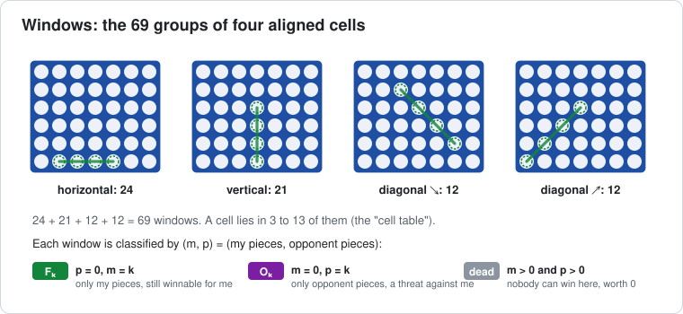
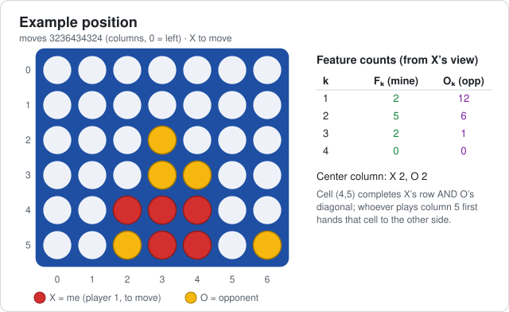
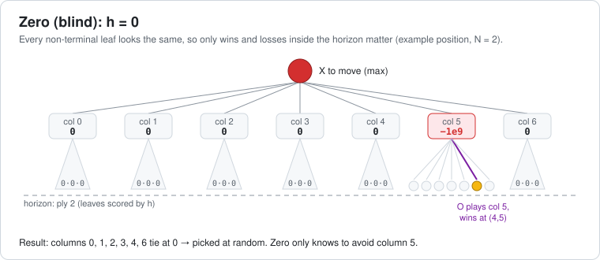
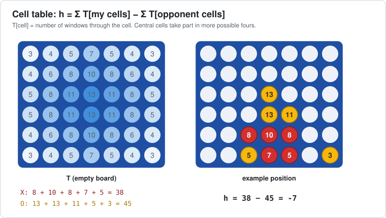
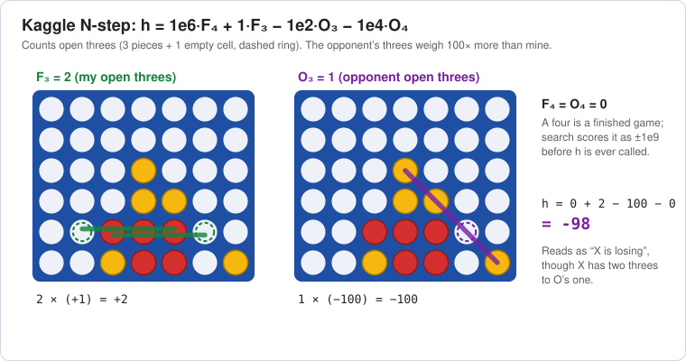
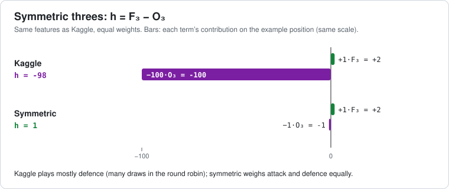
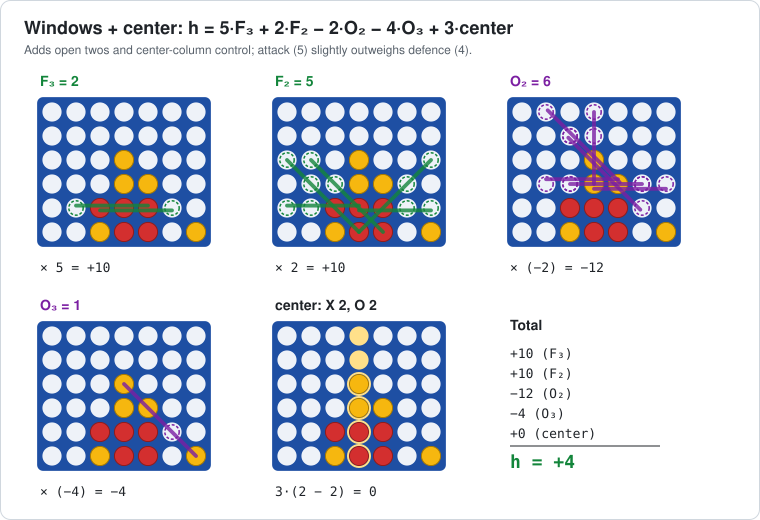

# Connect 4: minimax + alpha-beta, N-step lookahead benchmark

Plain HTML/CSS/JavaScript with no dependencies or build step. Open `index.html` in a browser.

| File | What it does |
|---|---|
| `engine.js` | Board, win detection, heuristics, minimax with optional alpha-beta and center-first move ordering |
| `bench.js` | Benchmarks: minimax vs alpha-beta node counts, N-step depth sweep, round robin tournament |
| `app.js`, `index.html`, `style.css` | Game UI (human/computer for either side, column scores, hint, undo) and the Benchmark tab |
| `bench-cli.js` | Runs the same benchmarks in Node and prints Markdown (`node bench-cli.js [--quick] [--games 40] [--max-depth 6] [--rr-depth 4] [--seed 42]`) |
| `RESULTS.md` | Output of `node bench-cli.js --games 40 --max-depth 6 --rr-depth 4` |
| `my-heuristics.js`, `lab-run.js` | Lab starter code: a custom heuristic and a tournament runner (see [Lab](#lab-design-your-own-evaluation-function)) |
| `docs/` | Diagrams used below; `node docs/make-diagrams.js` regenerates them from the engine |

The agents follow the [Kaggle N-step lookahead tutorial](https://www.kaggle.com/code/alexisbcook/n-step-lookahead/tutorial).
An N-step agent searches N plies (its move, the reply, …) and scores the leaves with a heuristic.
Terminal positions are scored directly as ±1e9, with faster wins scoring higher, so all heuristics handle wins and losses the same way.
Ties are broken at random.

## Heuristics

A heuristic is a function `h(cells, me)` that scores a non-terminal leaf from `me`'s point of view (`cells` is a 42-element array, index `row·7 + col`, row 0 at the **top**, values 0 = empty, 1 = first player, 2 = second player).

Most of the heuristics count **windows**: the 69 groups of four aligned cells where a four-in-a-row could be made. A window that holds only my pieces (k of them) is an F<sub>k</sub>. A window that holds only the opponent's pieces is an O<sub>k</sub>. A window holding pieces of both colours is dead: nobody can win there.



Every diagram below scores the same position, with X (player 1) to move:



X has an open three on row 4 that can be finished at either end, (4,1) or (4,5). Neither end is playable yet, because the cells below them are empty. O has a diagonal three that is also finished at (4,5). Whoever plays column 5 first fills (5,5), and the opponent then takes (4,5) and wins. The heuristics disagree about who is better here:

| Heuristic | Formula | h on the example | Move(s) at N=1 | Round robin N=4 ([RESULTS](RESULTS.md)) |
|---|---|---|---|---|
| Zero | `0` | 0 | any column (all tie) | 31.0% |
| Cell table | `Σ T[mine] − Σ T[opp]` | −7 | 2 or 4 | 74.8% |
| Kaggle N-step | `1e6·F4 + F3 − 1e2·O3 − 1e4·O4` | −98 | 2 or 6 | 53.5% |
| Symmetric threes | `F3 − O3` | +1 | 2 or 6 | 56.3% |
| Windows + center | `5·F3 + 2·F2 − 2·O2 − 4·O3 + 3·center` | +4 | 2 | 83.8% |

### Zero (blind)

`h = 0`. The pure-search baseline: the agent only knows about wins and losses it can reach within N plies, and picks at random among everything else. On the example at N=2 it sees that column 5 loses and treats the other six moves as equal. It still scores 62–70% against the Kaggle one-step agent at N=4–6 (RESULTS §2), which shows how much of Connect 4 is short-range tactics.



### Cell table

`h = Σ T[my cells] − Σ T[opponent cells]`, where `T[cell]` is the number of windows through that cell (3 in the corners, 13 in the middle). It rewards central control and ignores whether a window is still open. It is cheap, and it came second in the round robin.



### Kaggle N-step

`h = 1e6·F4 + 1·F3 − 1e2·O3 − 1e4·O4`, from the Kaggle tutorial. It counts open threes only, and an opponent three weighs 100× more than one of mine. The F<sub>4</sub>/O<sub>4</sub> terms never fire in this engine, because a position containing a four is terminal and search scores it before `h` is called. On the example it reads −98 ("X is losing") although X has two threes against O's one. In the round robin it played for draws: 34 draws, the most of any agent.



### Symmetric threes

`h = F3 − O3`. It uses the same features as Kaggle with equal weights, which isolates the effect of the 100× defensive bias. The bars below show both heuristics on the example, on the same scale.



### Windows + center

`h = 5·F3 + 2·F2 − 2·O2 − 4·O3 + 3·(my center pieces − opponent center pieces)`. A popular hand-tuned evaluation. It adds open twos, so it can tell positions apart before any three exists, plus a center-column bonus, and it weights attack slightly above defence. It is the best of the five at every depth.



---

## Lab: design your own evaluation function

A sequence of lab sessions for an undergraduate AI / algorithms course. Students already know minimax and alpha-beta. The labs treat the evaluation function as the part they design, and measure it experimentally against the built-in agents.

**Learning goals**

1. Explain why depth-limited search needs a heuristic, and what a heuristic can and cannot see.
2. Turn game knowledge into features and weights, then test the resulting function empirically instead of trusting intuition.
3. Reason about the trade-off between evaluation cost, search depth, and playing strength.
4. Report results with honest uncertainty (sample size, confidence intervals, held-out opponents).

**Prerequisites:** JavaScript basics, minimax/alpha-beta, and Node.js (any version from 10 on) or a browser.

### Setup

Two starter files are in the repo:

| File | What it does |
|---|---|
| `my-heuristics.js` | Defines `C4.features(cells, me)` (returns the F<sub>k</sub>/O<sub>k</sub> counts) and registers `C4.HEURISTICS.mine`. Students edit this file. Works in both Node and the browser. |
| `lab-run.js` | `node lab-run.js [depth=4] [gamesPerPair=40] [seed=1] [search=alphabeta]` plays a round robin between `mine`, Windows + center, Cell table and Kaggle N-step, then prints the standings (about 2 s at the defaults). `search` is `alphabeta` or `minimax`: both pick the same moves, so only the ms/move column changes. |

The part students change is the `fn` of the starter heuristic:

```js
C4.HEURISTICS.mine = {
  label: 'My heuristic',
  formula: 'h = 3·F₃ + F₂ − 3·O₃ − O₂',
  description: 'Lab starter: replace with your own evaluation.',
  fn: function (cells, me) {
    var f = features(cells, me);
    // TODO: return the formula above using f.F[k] and f.O[k].
    return 0;
  }
};
```

To add more agents to a run (for example the variants in Lab 3), register them in `my-heuristics.js` and add `{ heuristic: '<key>', depth: depth }` entries to the `agents` list in `lab-run.js`.

To play against your heuristic in the browser, add `<script src="my-heuristics.js"></script>` to `index.html` between `engine.js` and `app.js`. It then appears in every heuristic menu, including the Benchmark tab.

**Rules for every heuristic**

- It must be a pure function of `(cells, me)`: no global state, no randomness, no calls to `chooseMove`.
- Keep `|h|` well below 10<sup>8</sup>. Wins and losses score ±10<sup>9</sup>, and a heuristic value must never outrank a real win.
- `h` does not receive the side to move. If you need it, derive it from the piece counts: if both players have the same number of pieces, player 1 is to move.

**Reading results honestly.** Each pairing plays each random opening twice with the colours swapped. With n games, the 95% confidence interval on a score near 50% is roughly ±1.96·√(0.25/n):

| Games | 40 | 100 | 200 | 400 |
|---|---|---|---|---|
| ± | 15.5 pts | 9.8 pts | 6.9 pts | 4.9 pts |

So a 58% vs 52% difference over 40 games means nothing. Before claiming an improvement, use at least 200 games against an opponent and confirm the result with a seed you did not tune on.

### Lab 1: Evaluate by hand (about 45 min, pen and paper)

Position after moves `3324452`, scored for **X = player 1** (O is to move):

```
row 0  . . . . . . .
row 1  . . . . . . .
row 2  . . . . . . .
row 3  . . . . . . .
row 4  . . X O X . .
row 5  . . X X O O .
       0 1 2 3 4 5 6
```

1. Count F<sub>1</sub>, F<sub>2</sub>, F<sub>3</sub>, O<sub>1</sub>, O<sub>2</sub>, O<sub>3</sub>. Use the `T` grid in the cell-table diagram above to compute the cell-table score.
2. Compute all five heuristics by hand, then check your answers with `C4.HEURISTICS[key].fn(st.cells, 1)` and `C4.features(st.cells, 1)` (build `st` with `new C4.State()` and `st.play(col)`).
3. Which heuristics satisfy `h(s, X) = −h(s, O)` for every position? Why is that a natural property for a zero-sum game, and what does Kaggle's asymmetry say about its "personality"?
4. Explain why `1e6·F4` and `−1e4·O4` never change a decision in this engine.
5. Look again at the example position at the top of this page. Kaggle says −98 and Windows + center says +4. Which one would you trust, and what feature would settle the question? (Hint: who gets cell (4,5)?)

<details>
<summary>Answer key</summary>

1. F = [44, 5, 4, 0, 0], O = [44, 4, 1, 0, 0] (F<sub>0</sub> = O<sub>0</sub> = 44 empty windows). Cell table: X = 8 + 8 + 5 + 7 = 28, O = 10 + 5 + 4 = 19, h = 9.
2. Zero 0, cell table 9, Kaggle 0, symmetric 0, windows + center 2·4 − 2·1 = 6 (center 1 vs 1).
3. Zero, cell table, symmetric and windows + center are antisymmetric. Kaggle is not, because its own threes and the opponent's threes carry different weights. With an antisymmetric `h`, both players agree on the value of every position, which is the assumption minimax makes.
4. A position with four in a row is terminal. Search scores it ±1e9 before `h` is called, so F<sub>4</sub> = O<sub>4</sub> = 0 at every leaf `h` sees.
5. Open-ended. Cell (4,5) sits on an even row counting from the bottom (row 2), and both threats need it. In Connect 4 the second player usually benefits from even-row threats (see Lab 4, parity), so a parity-aware feature would rate this position as good for O.

</details>

### Lab 2: Your first evaluation function (about 90 min)

1. Replace `return 0;` in the starter heuristic with its `formula` (`h = 3·F₃ + F₂ − 3·O₃ − O₂`), run `node lab-run.js` and record its score. Then predict, before measuring, how changing each weight will affect it.
2. Write a linear evaluation using only F<sub>k</sub>, O<sub>k</sub> (k = 1..3) and a center term. Change one weight at a time and log every experiment as (weights, score, games, seed).
3. **Target:** score at least 55% against Windows + center at N=4 over 200+ games (`node lab-run.js 4 200`), then re-check it with a new seed.
4. **Report:** your best weights, a table of experiments, and one paragraph on which change helped most and why you think it did.

### Lab 3: Attack vs defence (about 60 min)

Kaggle uses a 100:1 defence-to-attack ratio, and Symmetric threes uses 1:1. Test the hypothesis with a family of heuristics, `h = F3 − k·O3`:

1. Register agents for k ∈ {0, 0.25, 0.5, 1, 2, 4, 10, 100}. A loop that creates `C4.HEURISTICS['k' + k]` works.
2. Play each one against Windows + center at N=2 and N=4 (use `pairs` or `Bench.gauntlet({ agents, reference, gamesPerPair, openingPlies, seed })`), and plot score vs k on a log axis.
3. Also plot the draw rate. Is there a k that maximises wins, and a different one that minimises losses?
4. Does the best k change with depth? Relate your answer to the odd/even dips in RESULTS §2: at odd N the last ply is your own move.

### Lab 4: New features (2 sessions)

Window counts ignore gravity: a three whose missing cell is floating high up is much weaker than one you can complete next move. Implement at least **two** of the following features, add each one to your evaluation separately, and measure each one's contribution (an ablation table: with and without each feature).

| Feature | Definition (engine coordinates: row 0 = top, cell below `i` is `i + 7`) |
|---|---|
| Playable threat | An F<sub>3</sub>/O<sub>3</sub> whose empty cell is playable now (`row === 5` or `cells[i + 7] !== 0`). If the side to move owns one, it is an immediate win. |
| Parity threat | Number the rows 1..6 from the bottom (`6 − row`). Player 1 benefits from threat cells on odd rows, player 2 from threat cells on even rows. Weight each threat by whether its parity suits its owner. |
| Double threat | An empty cell that completes two or more of your F<sub>3</sub> windows, or two of your threat cells stacked directly on top of each other in one column. Either is usually decisive. |
| Blocked threat | An O<sub>3</sub> whose empty cell sits directly above one of your own threat cells. The opponent cannot use it before you do. |
| Mobility / height | The number of non-full columns, or how low your threat cells are. |

Questions for the report:

- How much does each feature help at N=2, and does the gain shrink at N=4 or N=6? A feature that only helps at shallow depth is mostly doing the search's job.
- Re-score the example position with your features. Do they agree with the analysis in Lab 1, question 5?

### Lab 5: Cost vs strength (about 60 min)

A better evaluation is not free: it costs time at every leaf.

1. Measure nodes and ms per move for your heuristic with `Bench.searchBenchmark({ depths: [1, 2, 3, 4, 5, 6], positions: 30, heuristic: 'mine', seed: 42 })`, and compare with `windowsCenter` and `zero`.
2. The heuristic also changes how much alpha-beta prunes: a cutoff happens as soon as a value reaches the bound, so a heuristic that returns many equal values (like Zero) cuts off more often. Does your heuristic change the **node count**, and not just the time per node? Use the Zero row of the cost table in RESULTS §2 in your explanation.
3. **Equal-time match:** find the depth at which a cheap heuristic (Cell table or Zero) uses about the same ms/move as your heuristic at N=4. Play them against each other. Which matters more here, search or knowledge?

### Lab 6 (stretch): Automatic tuning

1. Put your weights in a vector and write `evaluate(weights)`: the score against a fixed set of opponents at N=2, with 100 games and a fixed seed.
2. Implement hill climbing or (1+1)-ES: perturb one weight, keep the change if the score improves, and repeat for about 50 iterations.
3. Validate the tuned weights at N=4 against **opponents and seeds not used during tuning**. How much of the gain survives? Discuss overfitting to opponents, to the seed, and to depth.
4. Optional: replace the fixed center-first move ordering in `engine.js` (`CENTER_ORDER`) with ordering by your heuristic, and measure the change in node count.

### Final class tournament

- **Submission:** one `my-heuristics.js` that registers `C4.HEURISTICS.<team>` and follows the rules above.
- **Format:** all submissions plus the five built-in agents play a round robin at N=4: 2-ply random openings, colours swapped, at least 100 games per pairing, and a seed announced after the deadline.
- **Limit:** average ≤ 2 ms per move on the grading machine (about 10× the built-ins), measured by `msPerMove`.

**Suggested rubric**

| Criterion | Weight |
|---|---|
| Correctness: pure, deterministic, within limits | 15% |
| Tournament placement (relative to the built-ins, not only to classmates) | 25% |
| Experimental method: logged experiments, enough games, held-out validation | 30% |
| Report: features explained, ablation table, honest discussion of what did *not* work | 30% |
